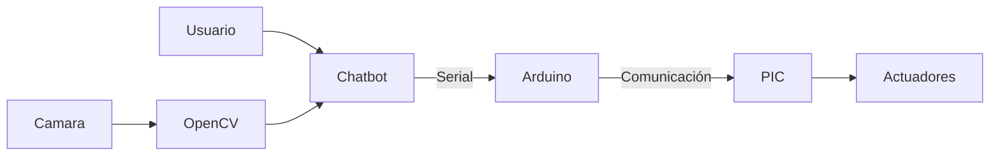
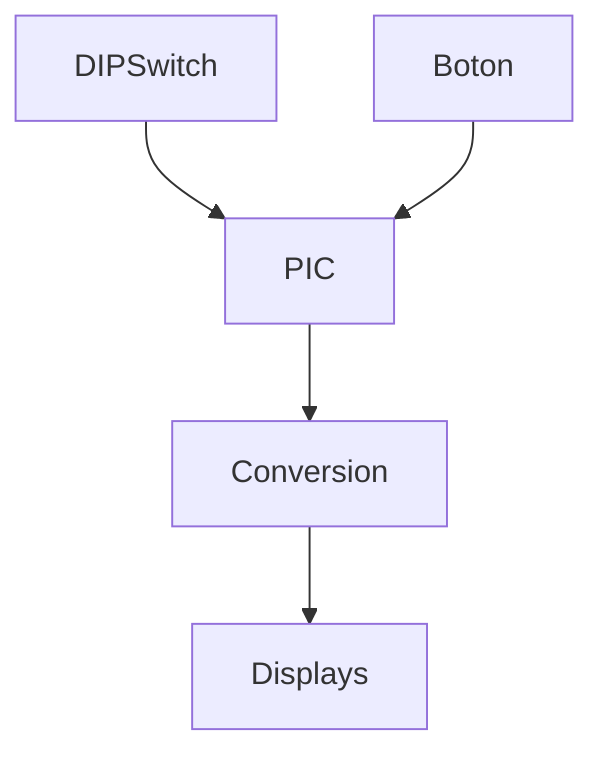
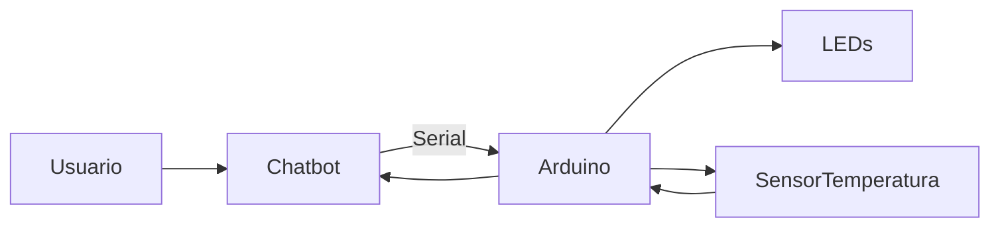
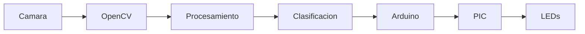

---

# Aplicaciones en Sistemas Embebidos

## Primer Laboratorio

---

## Badges


---

## Integrantes

* Valentina Diaz
* Paula Baez

---

## Descripción General

Este laboratorio tiene como objetivo la integración de diferentes tecnologías en sistemas embebidos, combinando:

* Microcontroladores (PIC y Arduino)
* Comunicación serial
* Programación en Python
* Visión artificial con OpenCV
* Interacción mediante chatbot

El desarrollo se divide en tres etapas progresivas, donde cada punto amplía la complejidad del sistema hasta lograr una integración completa entre hardware y software.

---

## Arquitectura General del Sistema



---

# Punto 1: Conversor Binario a Decimal, Octal y Hexadecimal

## Objetivo

Diseñar un sistema basado en el PIC16F887 que permita convertir un valor binario ingresado mediante un DIP Switch a diferentes sistemas numéricos:

* Decimal
* Octal
* Hexadecimal

Mostrando el resultado en displays de 7 segmentos mediante multiplexación.

---

## Descripción del funcionamiento

El sistema opera de la siguiente forma:

1. El usuario ingresa un valor binario a través del DIP Switch.
2. El PIC lee el valor desde el puerto B.
3. Un botón permite cambiar entre los modos de conversión.
4. El valor es transformado al sistema seleccionado.
5. Se visualiza el resultado en tres displays usando multiplexación.

---

## Diagrama del sistema



---

## Código

El microcontrolador lee ese valor y lo guarda en la variable:

```
valor = PORTB
```
Un **botón conectado al pin RA3** cambia el modo de visualización:

| Modo | Sistema numérico |
| ---- | ---------------- |
| 0    | Decimal          |
| 1    | Octal            |
| 2    | Hexadecimal      |

El número se convierte al sistema seleccionado.

Los **3 displays se controlan con multiplexación** para reducir pines.

```c
#include <xc.h>

#pragma config FOSC = XT
#pragma config WDTE = OFF
#pragma config LVP = OFF

#define _XTAL_FREQ 4000000

const unsigned char table[]={
0x3F,0x06,0x5B,0x4F,
0x66,0x6D,0x7D,0x07,
0x7F,0x6F,0x77,0x7C,
0x39,0x5E,0x79,0x71
};

unsigned char modo=0;
unsigned char d1,d2,d3;

void leer_boton()
{
    if(PORTAbits.RA3==1)
    {
        __delay_ms(40);

        if(PORTAbits.RA3==1)
        {
            modo++;

            if(modo>2)
                modo=0;

            while(PORTAbits.RA3==1);
        }
    }
}

void convertir(unsigned char valor)
{
    switch(modo)
    {

        case 0:

        d3 = valor/100;
        d2 = (valor%100)/10;
        d1 = valor%10;

        break;

        case 1:

        d3 = (valor/64)%8;
        d2 = (valor/8)%8;
        d1 = valor%8;

        break;

        case 2:

        d3 = 16;
        d2 = valor/16;
        d1 = valor%16;

        break;
    }
}

void multiplexar()
{

    PORTD = ~table[d1];
    PORTAbits.RA0 = 1;
    __delay_ms(3);
    PORTAbits.RA0 = 0;

    PORTD = ~table[d2];
    PORTAbits.RA1 = 1;
    __delay_ms(3);
    PORTAbits.RA1 = 0;

    if(d3 < 16)
    {
        PORTD = ~table[d3];
        PORTAbits.RA2 = 1;
        __delay_ms(3);
        PORTAbits.RA2 = 0;
    }
    else
    {
        __delay_ms(3);
    }
}

void main()
{

    ADCON1 = 0x06;

    TRISB = 0xFF;
    TRISD = 0x00;
    TRISA = 0x08;

    PORTD = 0xFF;

    unsigned char valor;

    while(1)
    {
        leer_boton();
        valor = PORTB;
        convertir(valor);
        multiplexar();
    }
}

```

---

## Evidencias

### Montaje del circuito físico


---

### Circuito en simulación


---

### Funcionamiento en físico

(Insertar imagen)


---

### Funcionamiento en simulación

(Insertar imagen)

```
/imagenes/punto1_funcionamiento_simulacion.png
```

---

### Video del funcionamiento

(Insertar GIF)

```
/gifs/punto1.gif
```

---

# Punto 2: Chatbot para control de iluminación y temperatura

## Objetivo

Desarrollar un sistema de control mediante un chatbot que permita interactuar con un Arduino para:

* Encender y apagar LEDs
* Consultar la temperatura de un sensor

---

## Descripción del funcionamiento

1. El usuario envía comandos por texto o voz.
2. El chatbot interpreta el mensaje.
3. Se envía un comando por comunicación serial al Arduino.
4. Arduino ejecuta la acción correspondiente.
5. Arduino responde con información (por ejemplo, temperatura).
6. El chatbot muestra o reproduce la respuesta.

---

## Diagrama del sistema



---

## Código chatbot por texto

```python
# Código aquí
```

---

## Código chatbot por voz

```python
# Código aquí
```

---

## Evidencias

### Montaje del circuito físico

(Insertar imagen)

```
/imagenes/punto2_montaje_fisico.jpg
```

---

### Circuito en simulación

(Insertar imagen)

```
/imagenes/punto2_simulacion.png
```

---

### Funcionamiento en físico

(Insertar imagen)

```
/imagenes/punto2_funcionamiento_fisico.jpg
```

---

### Funcionamiento en simulación

(Insertar imagen)

```
/imagenes/punto2_funcionamiento_simulacion.png
```

---

### Video del funcionamiento

(Insertar GIF)

```
/gifs/punto2.gif
```

---

# Punto 3: Sistema de reconocimiento con OpenCV, Arduino y PIC

## Objetivo

Implementar un sistema de visión artificial capaz de:

* Detectar colores
* Identificar figuras geométricas
* Enviar comandos a sistemas embebidos para ejecutar acciones

---

## Descripción del funcionamiento

1. La cámara captura imágenes en tiempo real.
2. OpenCV procesa la imagen en formato HSV.
3. Se aplican filtros para detectar colores.
4. Se identifican contornos.
5. Se clasifican figuras geométricas.
6. Se envían comandos al Arduino.
7. El Arduino comunica al PIC para activar salidas físicas.

---

## Diagrama del sistema



---

## Código detección de color

```python
# Código aquí
```

---

## Código detección de forma y color

```python
# Código aquí
```

---

## Evidencias

### Montaje del sistema físico

(Insertar imagen)

```
/imagenes/punto3_montaje_fisico.jpg
```

---

### Sistema en simulación

(Insertar imagen)

```
/imagenes/punto3_simulacion.png
```

---

### Funcionamiento en físico

(Insertar imagen)

```
/imagenes/punto3_funcionamiento_fisico.jpg
```

---

### Funcionamiento en simulación

(Insertar imagen)

```
/imagenes/punto3_funcionamiento_simulacion.png
```

---

### Video del funcionamiento

(Insertar GIF)

```
/gifs/punto3.gif
```

---

## Estructura del repositorio

```
/proyecto
│
├── /codigo
│   ├── pic
│   ├── arduino
│   └── python
│
├── /imagenes
│
├── /gifs
│
└── README.md
```

---

## Consideraciones técnicas

* Se utilizó multiplexación para optimizar el uso de pines en el PIC.
* La comunicación serial se estableció a 9600 baudios.
* OpenCV trabaja en espacio de color HSV para mejorar la detección.
* Se aplicaron filtros morfológicos para mejorar la precisión de detección.
* Se implementó control por eventos en el chatbot.

---

## Conclusiones

El desarrollo de este laboratorio permitió:

* Comprender el uso de microcontroladores en sistemas reales.
* Implementar comunicación entre diferentes plataformas.
* Integrar visión artificial con hardware.
* Diseñar sistemas interactivos mediante chatbot.
* Aplicar conceptos de procesamiento digital de señales e imágenes.

---


