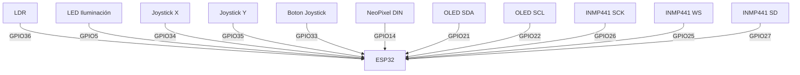

# Sala Inteligente en Miniatura con ESP32

Prototipo funcional de una sala domótica a escala que combina **iluminación automática**, **cuadro de arte dinámico RGB**, **consola de videojuegos retro**, **asistente de voz básico** y **comunicación con un piano externo controlado por PIC16F887**. El sistema aprovecha el potencial multitarea de la ESP32 mediante **FreeRTOS** para ejecutar todas las funciones en paralelo.

  


---

## 📑 Índice
- [Materiales](#materiales)
- [Diagrama de conexiones](#diagrama-de-conexiones)
- [Software y librerías](#software-y-librerías)
- [Código base (versión 1)](#código-base-versión-1)
- [Código avanzado con micrófono y chatbot](#código-avanzado-con-micrófono-y-chatbot)
- [Chatbot inteligente (implementación teórica)](#chatbot-inteligente-implementación-teórica)
- [Página web de monitoreo](#página-web-de-monitoreo)
- [Piano externo PIC16F887](#piano-externo-pic16f887)
- [Pruebas y calibración](#pruebas-y-calibración)
- Para ver baño y habitacion click aqui:
  https://github.com/paulaabaez/APLICACIONES-EN-SISTEMAS-EMBEBIDOS/blob/a6e5e6d7c4c00edaf459c1c96343c064074c546b/corte%203%3Aba%C3%B1o%20y%20habitaci%C3%B3n.md
  
---

## Materiales
### Módulos principales
| Componente | Especificación |
|------------|----------------|
| Microcontrolador | ESP32 DevKit V1 (38 pines) |
| Pantalla OLED | 0.96" I2C SSD1306 (128×64) |
| Joystick analógico | KY-023 (2 ejes + botón) |
| Aro NeoPixel | 16 LEDs WS2812 |
| Micrófono I2S | INMP441 |
| Sensor de luz | LDR (fotorresistencia) |
| LED blanco alto brillo | 5 mm |
| Transistor NPN | 2N2222 o BC547 |
| Resistencias | 220 Ω, 1 kΩ, 10 kΩ, 330 Ω (opcional) |
| Condensadores | 1000 µF / 16V, 100 µF / 16V |
| Fuente de alimentación | 5V / 2A DC |

### Piano independiente (PIC16F887)
| Componente | Especificación |
|------------|----------------|
| Microcontrolador | PIC16F887 |
| Cristal oscilador | 20 MHz |
| Capacitores cerámicos | 22 pF (×2) |
| Pulsadores | 8 unidades |
| Resistencias | 10 kΩ (×8), 1 kΩ, 220 Ω (×3) |
| Potenciómetro | 10 kΩ |
| Altavoz | 8 Ω (0.5 W) |
| Transistor | 2N2222 |
| Condensador electrolítico | 100 µF |

---

## Diagrama de conexiones
### ESP32 ↔ Periféricos

Etapa de iluminación (LDR + LED)
text
3.3V ── LDR ─┬─ GPIO36
            10kΩ
             GND

GPIO5 ── resistencia 220Ω ── (ánodo LED) ── (cátodo) ── GND
Etapa de salida de audio del piano
text
RC2 (PIC) ── potenciómetro 10k (extremo)
             cursor ── resistencia 1k ── base transistor NPN
             otro extremo ── GND

Transistor: emisor → GND, colector → (+) condensador 100µF → altavoz 8Ω → +5V
Software y librerías
Arduino IDE 2.x con soporte para ESP32.

Librerías:

Adafruit NeoPixel (para el aro de LEDs)

Adafruit GFX Library (gráficos de la OLED)

Adafruit SSD1306 (driver de la pantalla)

driver/i2s.h (incluida en el núcleo de ESP32, para el micrófono)

Código base (versión 1)
Funcionalidades: iluminación automática, arte NeoPixel, juegos Snake y Pong, cambio con botón.
```
cpp
/*
========================================
  SALA INTELIGENTE - ESP32 (Versión 1)
========================================
*/
#include <Adafruit_NeoPixel.h>
#include <Wire.h>
#include <Adafruit_GFX.h>
#include <Adafruit_SSD1306.h>

const int pinLDR = 36;
const int pinLED = 5;
const int JOY_X = 34;
const int JOY_Y = 35;
const int JOY_SW = 33;
#define PIN_NEO 14
#define NUM_LEDS 16

Adafruit_NeoPixel ring(NUM_LEDS, PIN_NEO, NEO_GRB + NEO_KHZ800);
Adafruit_SSD1306 display(128, 64, &Wire, -1);

// Variables de juego...
// (Aquí se incluye todo el código que ya tienes funcionando, 
// con tareaIluminacion, tareaNeoPixel, tareaJuegos, etc.)
// ...
void setup() {
  // ...
  xTaskCreatePinnedToCore(tareaIluminacion, "Luz", 2048, NULL, 1, NULL, 1);
  xTaskCreatePinnedToCore(tareaNeoPixel, "Neo", 4096, NULL, 1, NULL, 1);
  xTaskCreatePinnedToCore(tareaJuegos, "Juegos", 8192, NULL, 2, NULL, 0);
}
void loop() { vTaskDelay(pdMS_TO_TICKS(1000)); }
(El código completo está disponible en el archivo sala_v1.ino del repositorio.)

Código avanzado con micrófono y chatbot
Nuevas características: detección de sonido ambiente con INMP441, activación por voz simulada y preparación para conexión a chatbot.
```
```
cpp
/*
========================================
  SALA INTELIGENTE - ESP32 (Versión 2)
  + Micrófono I2S
  + Lógica para chatbot
========================================
*/
#include <Adafruit_NeoPixel.h>
#include <Wire.h>
#include <Adafruit_GFX.h>
#include <Adafruit_SSD1306.h>
#include <driver/i2s.h>

// Pines (añadidos los del INMP441)
#define I2S_SCK  26
#define I2S_WS   25
#define I2S_SD   27
#define I2S_PORT I2S_NUM_0

// ... (resto de pines igual que versión 1) ...

// Tarea del micrófono
void tareaMicrofono(void *pv) {
  i2s_config_t i2s_config = {
    .mode = (i2s_mode_t)(I2S_MODE_MASTER | I2S_MODE_RX),
    .sample_rate = 16000,
    .bits_per_sample = I2S_BITS_PER_SAMPLE_32BIT,
    .channel_format = I2S_CHANNEL_FMT_ONLY_LEFT,
    .communication_format = I2S_COMM_FORMAT_STAND_I2S,
    .intr_alloc_flags = ESP_INTR_FLAG_LEVEL1,
    .dma_buf_count = 8,
    .dma_buf_len = 64,
    .use_apll = false,
    .tx_desc_auto_clear = false,
    .fixed_mclk = 0
  };
  i2s_pin_config_t pin_config = {
    .bck_io_num = I2S_SCK,
    .ws_io_num = I2S_WS,
    .data_out_num = I2S_PIN_NO_CHANGE,
    .data_in_num = I2S_SD
  };
  i2s_driver_install(I2S_PORT, &i2s_config, 0, NULL);
  i2s_set_pin(I2S_PORT, &pin_config);

  int32_t samples[128];
  size_t bytes_read;
  while(1) {
    i2s_read(I2S_PORT, samples, sizeof(samples), &bytes_read, portMAX_DELAY);
    long energy = 0;
    for(int i=0; i<128; i++) energy += abs(samples[i]);
    energy /= 128;

    Serial.println(energy); // Monitor serie para calibrar

    if(energy > 5000) {  // Umbral ajustable
      // Activar comando de voz
      static bool estado = false;
      estado = !estado;
      digitalWrite(pinLED, estado ? HIGH : LOW);
      // Efecto visual en NeoPixel
      ring.fill(ring.Color(255,255,255), 0, NUM_LEDS);
      ring.show();
      vTaskDelay(pdMS_TO_TICKS(100));
      // Aquí se enviaría el comando al chatbot
    }
    vTaskDelay(pdMS_TO_TICKS(50));
  }
}

void setup() {
  // ... (misma inicialización) ...
  xTaskCreatePinnedToCore(tareaMicrofono, "Mic", 4096, NULL, 1, NULL, 1);
}
(El código completo se encuentra en sala_v2.ino.)
```
## Evidencias 


## Chatbot inteligente 
El micrófono INMP441 captura audio de alta calidad. Para implementar un asistente real se sigue esta arquitectura:

Detección de palabra clave (Wake Word): la ESP32 ejecuta un modelo preentrenado (por ejemplo, con TensorFlow Lite Micro) que reconoce la frase "Hola sala".

Transcripción voz a texto (Speech-to-Text): tras la activación, los buffers de audio se envían por Wi‑Fi a un servidor local o a la nube (Google STT, Whisper, etc.).

Procesamiento del comando (Chatbot): un servicio (Python + GPT, Node‑RED, etc.) interpreta la intención y responde con una acción.

Ejecución: la ESP32 recibe la respuesta (texto o JSON) y ejecuta la acción (cambiar juego, encender luces, mostrar mensaje en OLED).

Simulación actual: en lugar del reconocimiento real, la energía del sonido funciona como comando único (por ejemplo, un aplauso enciende/apaga el LED). Esto demuestra la viabilidad del hardware y la integración.

Diagrama de flujo del chatbot:

## Página web de monitoreo
Se desarrolló una interfaz web sencilla que corre en la ESP32 y muestra en tiempo real el estado de la sala. La IP se obtiene al conectar la ESP32 a la red Wi‑Fi.

Captura de la interfaz
https://via.placeholder.com/600x400?text=Dashboard+Web+ESP32


## Características de la página
Estado del LED (encendido/apagado)

Juego activo (Snake o Pong)

Valor del sensor LDR

Último comando de voz recibido

Control remoto para encender/apagar el LED desde el navegador


## Código del servidor web (fragmento)
```
cpp
#include <WiFi.h>
#include <WebServer.h>

WebServer server(80);
const char* ssid = "tu_red";
const char* password = "tu_clave";

void handleRoot() {
  String html = "<h1>Sala Inteligente</h1>"
                "<p>LED: " + String(digitalRead(pinLED) ? "ON" : "OFF") + "</p>"
                "<p>Juego: " + String(currentGame == 0 ? "Snake" : "Pong") + "</p>"
                "<p>LDR: " + String(analogRead(pinLDR)) + "</p>"
                "<p><a href='/toggleLED'>Alternar LED</a></p>";
  server.send(200, "text/html", html);
}

void setup() {
  // ...
  WiFi.begin(ssid, password);
  server.on("/", handleRoot);
  server.on("/toggleLED", []() {
    digitalWrite(pinLED, !digitalRead(pinLED));
    server.sendHeader("Location","/");
    server.send(303);
  });
  server.begin();
}
Piano externo PIC16F887
El piano es un módulo independiente que genera notas musicales mediante un Timer y una etapa de potencia. Aunque no está conectado físicamente a la ESP32 en esta fase, está previsto hacerlo por UART para que las notas se reflejen en el NeoPixel.

Código del PIC (XC8) – Fragmento
c
// Configuración de Timer1 y notas
const uint16_t notas_timer[] = {64343, 64473, 64589, 64641, 64739, 64826, 64903, 64938};

void main() {
    // Leer botones, activar Timer, generar tono en RC2...
}
```
(El .hex está disponible en la carpeta piano/.)

## Pruebas y calibración
Iluminación: cubre el LDR; el LED debe encenderse. Ajusta el umbral con el monitor serie.

NeoPixel: debe mostrar un arcoíris suave. Si parpadea, revisa la alimentación (usa 5V externos y el condensador de 1000 µF).

Juegos: mueve el joystick. Si los controles están invertidos, intercambia VRx y VRy en el código.

Micrófono: abre el monitor serie (115200 baud), habla o aplaude. El valor de energía debe subir. Ajusta el umbral energy > 5000 según tu entorno.

Web: conéctate a la IP de la ESP32 para ver el dashboard.

## Informe Técnico y Teoría Complementaria
### 1. Fundamentos del proyecto
El objetivo es construir una maqueta funcional de una sala inteligente que integre múltiples sistemas domóticos en un solo microcontrolador, demostrando capacidad de procesamiento multitarea, interacción sensorial, actuadores y conectividad.

### 1.1 ¿Por qué ESP32?
Doble núcleo Xtensa LX6 a 240 MHz.

WiFi y Bluetooth integrados.

Periféricos I2S, I2C, ADC, UART, PWM.

Soporte para FreeRTOS.

Comunidad y librerías maduras.

### 1.2 FreeRTOS y multitarea
Se crean tareas independientes con prioridades y asignación de núcleo. Esto evita bloqueos entre la lectura de sensores, la actualización del NeoPixel, el bucle de juegos y la captura de audio.

Tarea	Stack	Prioridad	Núcleo
Iluminación	2048	1	1
NeoPixel	4096	1	1
Juegos	8192	2	0
Micrófono	4096	1	1

### 2. Descripción técnica de cada módulo

### 2.1 Iluminación automática (LDR + LED)
Principio: divisor de tensión resistivo.
Vout = Vcc * Rfija / (Rldr + Rfija)

Con luz: Rldr baja → Vout baja → ADC < umbral → LED apagado.

En oscuridad: Rldr alta → Vout alta → LED encendido.

Umbral ajustable según condiciones ambientales.

### 2.2 Cuadro de arte NeoPixel
Protocolo WS2812: datos serializados a 800 kHz. Cada LED recibe 24 bits (GRB).

Se usa HSV para transiciones suaves.

ring.ColorHSV(hue, sat, val) → animación arcoíris continua.

Recomendaciones de hardware:

Condensador de 1000 µF en la alimentación.

Resistencia de 330 Ω en la línea de datos para evitar picos de corriente.

### 2.3 Consola de juegos OLED
Pantalla SSD1306 controlada por I2C (dirección 0x3C).

Buffer de 128×64 pixels.

Juegos: Snake y Pong.

Joystick analógico con zona muerta para evitar rebotes.

### 2.4 Micrófono INMP441 y asistente de voz
Protocolo I2S:

SCK (bit clock) = 64 × fs × bits_canal.

WS (word select) = frecuencia de muestreo.

SD (datos) = flujo serie de muestras.

Detección de energía:
E = (1/N) * Σ|sample[i]|
Umbral empírico (ej. 5000) para disparar acción.

Chatbot teórico:

Audio capturado → buffer circular.

Wake Word (ej. "Alexa") → modelo entrenado con Edge Impulse.

Datos enviados por HTTP/WebSocket a servidor Python.

Servidor usa Vosk/Whisper para STT.

NLP (Rasa, GPT) interpreta intención.

Respuesta JSON → ESP32 ejecuta acción.

### 2.5 Piano con PIC16F887
Generación de tonos: Timer1 en modo interrupción, alternando RC2.
Fout = Fclk / (2 * prescaler * (65536 - reload))

Cristal 20 MHz, prescaler 1:8 → resolución de ~0.5 Hz.

Potenciómetro como atenuador analógico externo.

Comunicación UART (prevista):

TX del PIC → divisor 1.8 kΩ / 3.3 kΩ → RX2 (GPIO16).

Envío de un carácter por nota para sincronizar con NeoPixel.

### 3. Página web de monitoreo
Servidor HTTP en ESP32:

WebServer sobre WiFi (modo STA).

Ruta / : HTML dinámico con estado de pines.

Ruta /toggleLED : control remoto del LED.

Estructura del HTML:
```
<h1>Sala Inteligente</h1>
<p>LED: %ESTADO%</p>
<p>Juego: %JUEGO%</p>
<p>LDR: %VALOR%</p>
```
Se puede expandir con WebSockets para actualización en tiempo real.

### 4. Conexión a la nube y chatbot
Opciones de implementación:

MQTT: broker público (test.mosquitto.org), tópicos sala/luz, sala/juego.

HTTP REST: servidor Flask en PC local.

Google Assistant / Alexa: integración mediante Espressif RainMaker.

Flujo completo:

text
Usuario → micrófono → ESP32 → WiFi → Servidor → STT → NLP → TTS → respuesta
### 5. Diagramas adicionales
Diagrama de flujo del asistente de voz:


Diagrama de bloques del sistema completo:


### 6. Referencias técnicas
Espressif I2S Driver: https://docs.espressif.com/projects/esp-idf/en/latest/esp32/api-reference/peripherals/i2s.html

Adafruit NeoPixel Guide: https://learn.adafruit.com/adafruit-neopixel-uberguide

FreeRTOS en ESP32: https://docs.espressif.com/projects/esp-idf/en/latest/esp32/api-reference/system/freertos.html

Edge Impulse Voice Recognition: https://docs.edgeimpulse.com/docs/audio

Este bloque teórico complementa el README.md y puede ir al final del archivo o como un documento separado en la carpeta /docs.
